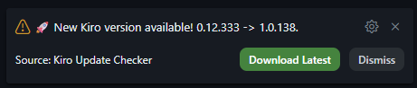
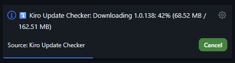
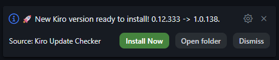

# Kiro Update Checker

  

Automatically checks the official Kiro downloads page for new IDE releases. Intended for users running Kiro in Administrator mode, where the built-in update feature may not be available.

## Features

- Checks for new Kiro IDE releases on startup and at configurable intervals
- Notifies you when a new version is available
- Supports auto-downloading the installer
- Manual check command: **Kiro: Check for Updates Now**
- Dismiss notification for a specific version
- **Cross-platform**: Windows (.exe), macOS (.dmg), Linux (.deb, .tar.gz)
- **12 languages**: adapts to your VS Code/Kiro interface language

## Screenshots

  
   
  <em>New version available notification</em>

  
   
  <em>Auto-download in progress</em>

  
   
  <em>Ready to install</em>

## Extension Settings

This extension contributes the following settings:

| Setting | Default | Description |
|---------|---------|-------------|
| `kiroUpdateChecker.enableOnStartup` | `true` | Whether to check for updates on startup |
| `kiroUpdateChecker.autoDownload` | `false` | Whether to automatically download and install new versions |
| `kiroUpdateChecker.downloadFolder` | `""` | Custom folder to download updates to (empty = Downloads folder) |
| `kiroUpdateChecker.checkInterval` | `60` | Interval in minutes to check for updates (0 = disable) |
| `kiroUpdateChecker.packageFormat` | `"auto"` | Override the package format for downloads (auto, deb, tar.gz, AppImage, dmg, exe) |

## Commands

- **Kiro: Check for Updates Now** (`kiro-update-checker.checkNow`) — manually trigger an update check

## Supported Languages

| Language | Locale |
|----------|--------|
| English | `en` |
| Português (Brasil) | `pt-BR` |
| Português (Portugal) | `pt-PT` |
| Español | `es` |
| Français | `fr` |
| Deutsch | `de` |
| Italiano | `it` |
| 日本語 | `ja` |
| 한국어 | `ko` |
| 简体中文 | `zh-cn` |
| हिन्दी | `hi` |
| Русский | `ru` |

## Requirements

- Kiro IDE (Visual Studio Code fork)
- Windows, macOS, or Linux

## Known Issues

- Version detection relies on parsing the Kiro downloads page HTML

## Release Notes

### 0.2.0

- Cross-platform download support: Windows (.exe), macOS (.dmg), Linux (.deb, .tar.gz)
- Platform auto-detection + correct install command per OS
- `packageFormat` setting: choose package type or auto-detect
- 12 language translations (en, pt-BR, pt-PT, es, fr, de, it, ja, ko, zh-cn, hi, ru)
- Auto-publish to Open VSX via GitHub Actions
- Linux URL pattern fix (extra `/deb/` or `/tar/` path segment)
- `checkUrl()`: HEAD request safety check with 403 fallback

### 0.1.4

- Publisher changed to `roalvesrj` for auto-verified namespace on Open VSX

### 0.1.3

- Localization support: English, Portuguese (pt-BR), Spanish (es) for settings and messages
- Protection: extension only activates on Kiro IDE
- Custom extension icon
- Auto-generated release body from CHANGELOG
- Safety: max redirect hops, Output panel logging fixed, button comparisons use translated text
