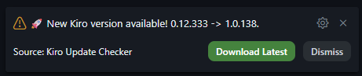
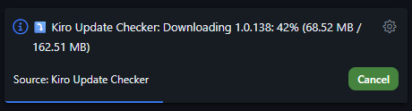
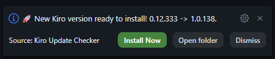

# Kiro Update Checker

  

Automatically checks the official Kiro downloads page for new IDE releases. Intended for users running Kiro in Administrator mode, where the built-in update feature may not be available.

> **Disclaimer:** This is a community extension, not officially maintained by the Kiro team.

## Features

- Checks for new Kiro IDE releases on startup and at configurable intervals
- Notifies you when a new version is available
- Supports auto-downloading the installer
- Manual check command: **Kiro: Check for Updates Now**
- Dismiss notification for a specific version
- **Release Notes button**: opens official Kiro changelog in your browser
- **Cross-platform**: Windows (.exe), macOS (.dmg), Linux (.deb, .tar.gz)
- **15 languages**: adapts to your VS Code/Kiro interface language

## Screenshots

  
   
  <em>New version available notification</em>

  
   
  <em>Auto-download in progress</em>

  
   
  <em>Ready to install</em>

## Extension Settings

This extension contributes the following settings:

| Setting | Default | Description |
|---------|---------|-------------|
| `kiroUpdateChecker.enableOnStartup` | `true` | Whether to check for updates on startup |
| `kiroUpdateChecker.autoDownload` | `false` | Whether to automatically download and install new versions |
| `kiroUpdateChecker.downloadFolder` | `""` | Custom folder to download updates to (empty = Downloads folder) |
| `kiroUpdateChecker.checkInterval` | `60` | Interval in minutes to check for updates (0 = disable) |
| `kiroUpdateChecker.packageFormat` | `"auto"` | Override the package format for downloads (auto, deb, tar.gz, AppImage, dmg, exe) |

## Commands

- **Kiro: Check for Updates Now** (`kiro-update-checker.checkNow`) — manually trigger an update check

## Supported Languages

| Language | Locale |
|----------|--------|
| English | `en` |
| Português (Brasil) | `pt-BR` |
| Português (Portugal) | `pt-PT` |
| Español | `es` |
| Français | `fr` |
| Deutsch | `de` |
| Italiano | `it` |
| 日本語 | `ja` |
| 한국어 | `ko` |
| 简体中文 | `zh-cn` |
| हिन्दी | `hi` |
| Русский | `ru` |
| العربية | `ar` |
| Türkçe | `tr` |
| Tiếng Việt | `vi` |

## Requirements

- Kiro IDE (Visual Studio Code fork) based on VS Code **1.93.0 or newer**
- Windows, macOS, or Linux

> **Note:** version 0.3.0+ requires a Kiro build based on VS Code ≥ 1.93 (for the `TerminalShellIntegration` API). Users on older Kiro builds will remain on 0.2.2.

## Known Issues

- Version detection relies on parsing the Kiro downloads page HTML

## Release Notes

### 0.3.0

- **Security hardening:** fixed command injection via installer launch (now uses `TerminalShellIntegration` with escaped args)
- **Security hardening:** downloads only follow HTTPS redirects to `kiro.dev` hosts; untrusted/reused files are verified by size and re-downloaded when stale
- **Security hardening:** partial downloads no longer presented as complete (`.part` + size check + atomic rename)
- **Security hardening:** download UI no longer sticks on network errors (stream error handlers added)
- **Security hardening:** downloads page HTML capped at 5 MB; symlink attacks on the download target blocked
- **Breaking change:** minimum VS Code/Kiro engine raised to 1.93.0
- Localization migrated to the official `vscode.l10n` API

### 0.2.2

- **Release Notes button** now opens the actual changelog URL extracted from the Kiro downloads page instead of a version-constructed link

### 0.2.1

- Added Arabic (ar), Turkish (tr), Vietnamese (vi) translations
- Fixed `detectLinuxDistro` test to pass on Linux CI runners

### 0.2.0

- Cross-platform download support: Windows (.exe), macOS (.dmg), Linux (.deb, .tar.gz)
- Platform auto-detection + correct install command per OS
- `packageFormat` setting: choose package type or auto-detect
- 12 language translations (en, pt-BR, pt-PT, es, fr, de, it, ja, ko, zh-cn, hi, ru)
- Auto-publish to Open VSX via GitHub Actions
- Linux URL pattern fix (extra `/deb/` or `/tar/` path segment)
- `checkUrl()`: HEAD request safety check with 403 fallback
- **Release Notes button**: opens `kiro.dev/changelog/ide/{version}/` in your browser from any notification

### 0.1.4

- Publisher changed to `roalvesrj` for auto-verified namespace on Open VSX

### 0.1.3

- Localization support: English, Portuguese (pt-BR), Spanish (es) for settings and messages
- Protection: extension only activates on Kiro IDE
- Custom extension icon
- Auto-generated release body from CHANGELOG
- Safety: max redirect hops, Output panel logging fixed, button comparisons use translated text
